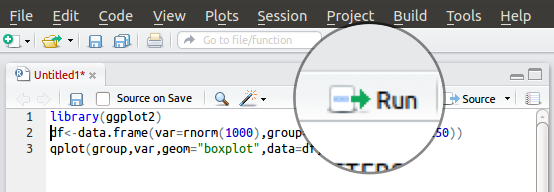
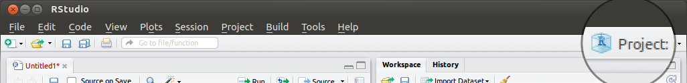

```{r setup, include=FALSE}
knitr::opts_chunk$set(
  # pour l'énoncé
  # echo=FALSE, eval=FALSE,
  # pour la correction
  echo=TRUE, eval=TRUE,
  comment=""
)
options(stringsAsFactors=TRUE)
```


# Introduction to statistics and R

## R and RStudio

R is a programming language oriented towards data analysis. It allows to read data from text files, perform computations on the data using a myriad of ready-made functions, and produce plots or new data tables as the result of the analyses.

Download it from <http://cran.r-project.org/>. The installation is a matter of double clicking the installer and saying OK to everything.

R code is just text, so you can edit it with any text editor (Notepad, etc.) but having a dedicated editor helps. On all platforms, RStudio <http://rstudio.org/> provides a complete development environment for R. This is what we will use. We will always open R through RStudio.

By default, the RStudio interface looks like this


Where

1. Source code editor: this is where we will write commands that can then be sent to be executed in the console (below). The file can then be saved as a "R Script" with the extension `.R`.
2. Console: write or copy-paste code here and press enter to see the result.
3. Workspace: when we assign a value to a variable or read data from a file, the name and description of the variable/data will be displayed here.
4. Plots: space where plots appear and from which they can be saved; Files: file browser (to pick R scripts to be edited or data files to be imported); Help: where you can search R's documentation.


## Syntax and operators

```{r echo=TRUE}
2 + 4
# spaces don't matter
2+4
# line breaks are handled when R "knows" to expect something
2+
4
# but the following does not work as expected
2
+4
```

Use spaces and linebreaks to make your code *human*-readable. To R it does not matter, to your collaborators (or you in two months) it does!

R has all the basic arithmetic operators

```{r echo=TRUE}
2 + 4
4 - 5
3 * 4
3 / 5
3^2
4^-1
3 * (2 + 5)
# modulo
4 %% 2
4 %% 3
```

It can also perform "tests" a.k.a. logical operations, that answer `TRUE` or `FALSE`

```{r echo=TRUE}
3 == 2
3 != 2
3 > 2
3 >= 2
3 < 3
3 <= 3

# operators can be combined
4==4 & 5==6
4==4 | 5==6

# whole operations can be negated
!(4==4 | 5==6)
```

<div class="exo">
Practice:

- Compute powers of 35 until 3.
- Write a line which tests if 246 is odd or even (should answer TRUE if even).
- What is the result of (without executing the lines of course...):

```{r echo=TRUE, eval=FALSE}
( 5 == 4 | 8 / 2 == 4 ) & 3 > 1.5 * 2

! 3 > 5 & 2 == 2
```
 
```{r}
35^1
35^2
35^3

( 246 %% 2 ) == 0

( 5 == 4 | 8 / 2 == 4 ) & 3 > 1.5 * 2
! 3 > 5 & 2 == 2
```
</div>


## Data formats and indexing

Values can be assigned to variables. For example

```{r echo=TRUE}
# assigning a value
x = 3
# this form is preferred in R
x <- 3
# because
x = 3
y = 4
x = y
# this is slightly unclear: is the value of y put in x or the opposite?
# this, on the other hand, is explicit
x <- y
```

### Scalars

```{r echo=TRUE}
# numbers = numeric or integer
x <- 3
x
# or text = character string
x <- "a"
x <- "foo"
x
# or booleans = logical
x <- TRUE
x <- FALSE
x
```

Once defined, variables appear in the Workspace tab together with their types, dimensions, and some of the values they store.

```{r echo=TRUE}
# they can be overwritten
x <- 2
x
x <- 5
x
# or computed with
x * 2
```

Note on variable names:

- should be simple but explicit
- cannot start with a number
- can make use of `_`, `.`, or case to separate words: `my_variable`, `my.variable`, `myVariable`. The `.` is not the best idea (because it has a special meaning in R) even though you will find it often used.

<div class="exo">
Practice:

- Define a variable that contains your name.
- Define another one that contains your age.

```{r}
my_name <- "Jean-Olivier"
my_age <- 25
# although I have been 25 for quite some time now...
```
</div>


### Vectors

```{r echo=TRUE}
x <- c(2, 5, 6)   # c() stands for "combine"
x
# vectors of several kinds
x <- c("foo", "bar")
x
x <- c(TRUE, FALSE, T, T, F)
x
# but a vector can contain only one data type
x <- c(1, "foo", TRUE)
x
# x now contains the string "1" and the string "TRUE"
# those are not a number and a boolean anymore!
```

Once the vector is defined, you can extract data from it

```{r echo=TRUE}
# extracting data from a vector
x <- c(2, 45, 33, 56)

# specify the index = the position you want to extract
x[2]
# or several indexes
x[c(1,3)]
```

and compute with it. Operations are repeated for each element of the vector

```{r echo=TRUE}
x
x + 1
x - 3
# that also works for logical operations!
x < 40
```

Categorical variables can be represented as character strings (or logicals if they are binary). However, in statistics, categorical variables often need to be treated in a special way: some have an order, it is often useful to know what all categories are even if not all of them are represented in the sample, etc. R as a special vector type for these categorical variables, which are meant to be used as "factors" in statistical analyses (such as ANOVA)

```{r echo=TRUE}
x <- factor(c("small", "medium", "large", "small"))
x[c(1,2)]   # the factor levels are remembered
levels(x)   # can be listed
nlevels(x)  # and counted

# NB: factors are coded internally as integers
as.numeric(x)
# and this often leads to bugs and headaches, beware!
```

<div class="exo">
Practice:

- Create a vector listing the seasons.
- Extract summer and winter from that vector.
- Create a vector containing your guess for the average temperature in Paris during those seasons.
- Test which temperatures are strictly greater than 15ºC.

```{r}
seasons <- c("Spring", "Summer", "Fall", "Winter")
seasons[c(2,4)]

temp <- c(18, 25, 17, 10)
temp > 15
```
</div>


### Matrices

NOTE JO 2017-05-10 : Peut-être peut-on sauter les matrices qui sont finalement rarement utilisées au niveau auquel sont les étudiants.

```{r echo=TRUE, error=TRUE}
x <- matrix(c(1,2,4,5,2,6), nrow=2)
x

# indexing matrices
x[1,3]
x[1,]   # all columns

# default multiplication is term by term
x * x
# matrix multiplication is done with %*%
y <- matrix(c(1,2,1,4,5,4), nrow=3)
x
y
# term by term multiplication does not work because the matrices have different sizes
x * y
# matrix multiplication is OK because the sizes are conformable
x %*% y
```

### Tabular data (data.frame)

A spreadsheet-like table can be stored as a data.frame in R. The data.frame is your friend. You shall love the data.frame and cherish it with all your heart.

```{r echo=TRUE}
# each column is a vector
x <- c(1.2, 2.3)
y <- c(40.1, 50.2)
data.frame(x, y)

# can be constructed directly
data.frame(c(1.2, 2.3), c(40.1, 50.2))

# can use columns of different types (as in a spreadsheet, yay!)
data.frame(c(1,2), c("foo","bar"))

# can use named columns to be clearer
x <- data.frame(
  month       = c("Jan", "Feb", "Mar"),
  temperature = c( 9,     8,     11)
)
# NB: note how I break lines and use spaces to make the code more
#     human-readable ;-)
x
```

data.frames work just like tables in spreadsheets, so the constraints are:

- each column can only hold one type of data (remember, each column is a vector)
- all columns must have the same number of lines

```{r echo=TRUE, error=TRUE}
# this doesn't work because the columns are of different length
data.frame(
  month       = c("Jan", "Feb", "Mar"),
  temperature = c( 9,     8)
)
# but, be careful: the following works because the short vector gets *repeated* an appropriate number of times.
data.frame(
  month       = c("Jan", "Feb", "Mar", "Apr"),
  temperature = c( 9,     8)
)
# this can lead to mistakes but allows to easily specify defaults
data.frame(month=c("Jan", "Feb", "Mar", "Apr"), temperature=1)
```

Once a data.frame is defined data can be extracted from it and computed with

```{r echo=TRUE}
x[1,3]      # by row and column indexes
x[1,]       # whole row
x[,2]       # whole column
x[,c(1,2)]  # several columns

x[,"month"] # by name
x$month     # useful shorthand
```

To add new columns, you can just define them

```{r echo=TRUE}
# either manually
x$rainfall <- c(35, 14, 23)
x
# or computed based on the content of other columns
# the computation is done for each element (like expanding a formula in excel does)
x$temperature_F <- x$temperature * 9/5 + 32
x
```

<div class="exo">
Practice:

- extract the temperature in Paris from the following data frame

```{r echo=TRUE, eval=TRUE}
d <- data.frame(
  city=c("Nice", "Brest", "Paris"),
  temperature=c(25, 18, 14)
)
d
```
 
```{r}
d$temperature[3]
# or
d[3,2]
# or
d[3,"temperature"]
# but the first form is the best
```

- create a new data.frame containing the season (as factor), a numeric value with your estimate for average temperature in Paris during this season, and a boolean telling whether you like this season or not

```{r}
meteo <- data.frame(
  season = factor(c("Spring", "Summer", "Fall", "Winter")),
  temp   =        c( 18,       25,       17,     10),
  like   =        c(TRUE,      FALSE,    TRUE,   FALSE)
)
meteo
```
</div>

### Lists

When data is multiform (various types, various lengths, etc.) it can still be stored together, in a list.

```{r echo=TRUE}
x <- list(c(1,2,3), c("foo","bar"), c(TRUE,FALSE,FALSE))
x
# lists can also be named
x <- list(
  city="Paris",
  seasonal_temperatures=c(18, 25, 17, 10),
  coordinates=c(48.85, 2.35),
  is_in_the_north=TRUE
)
x
```

You will rarely define list but you will often extract elements from lists, because all functions that perform statistical tests return a list.

```{r echo=TRUE}
# by index or name
x[[1]]
x[["city"]]
x$city
# simple brackets extract a sub-list
x[c(1,3)]
# so beware:
y <- x[[1]]
y
class(y)  # extracts the *content* of the first element of x
z <- x[1]
z
class(z)  # extracts a *list* with only one element
```

Note: data.frames are in fact lists in which each element is required to have the same length.

<div class="exo">
Practice:

In the following list
```{r echo=TRUE, eval=TRUE}
x <- list(
  city="Paris",
  seasonal_temperatures=c(18, 25, 17, 10),
  coordinates=c(48.85, 2.35),
  is_in_the_north=TRUE
)
x
```

- extract the coordinates
- extract the temperature for the second season

```{r}
x$coordinates
# or
x[[3]]
# but this is much less explict

x$seasonal_temperatures[2]
```
</div>

## Missing values

Often, some values are missing = not-available. R has a specific code for this (`NA`), which is taken into account in all computations.

```{r echo=TRUE}
x <- c(3, 4.1, NA, 5)
x
# NA are "contagious"
x + 1

# you can test which values are missing 
is.na(x)
# or remove them (once you have verified they were not too numerous!)
na.omit(x)

# in data.frames, omitting NAs removes the whole line
d <- data.frame(x=c(1, 2), y=c(3.5, NA))
d
na.omit(d)
```

## Finding functions and reading help

R has many ready-made functions. It is very likely a function to do what you want to do already exists. The problem is therefore finding it.

For example, we want to compute the average (mean) of several numbers. How can we find the function that does this?

1. Google for "mean r" and find help files or tutorials.
2. Use <http://rseek.org/> which is basically Google restricted to R-relevant results.
2. Search all the R functions *installed on your machine* for something that works

```{r echo=TRUE}
help.search("mean")
# or simply
??mean
```

Functions are listed within their "package", with the syntax `package::function`. A package is a collection of functions. Several packages are installed by default. Thousands of others can be installed (from the "Packages" tab).

The most basic statistical functions are in the `base` and `stats` packages, which is the case here: we were looking for `base::mean` (or simply `mean`). Once we know the function name, we can read its help. To get to the hep file, click on the links in the "Help" tab, or search for the function name in the help tab, or search from the console

```{r echo=TRUE}
help("mean")
# or simply
?mean
```

R help files are almost always formated the same way:

- `function {package}`
- Title
- Description: one line description
- Usage: calling syntax
- Argument: detailled description of each argument listed in "Usage"
- Details: details about the implementation/usage when it is complex (not really the case here)
- Value: value returned by the function
- References: bibliographic references on which the function is based. For advanced statistical methods, which are not well known and for which you need to cite a reference, these are what you should read and cite. *Never* (ever, ever, really) cite an R function assuming it is a proper reference.
- See Also: other functions similar to the current one
- Examples: examples of usage, which you can copy-paste or run with

```{r echo=TRUE}
example("mean")
```

<div class="exo">
Practice:

- Compute the mean of temperature values in the data.frame you created earlier.
- Find the function to compute the median and compute the median temperature.

```{r}
mean(meteo$temp)

median(meteo$temp)
```

</div>

## Useful functions

Create sequences of numbers

```{r}
seq(from=1, to=5, by=1)
seq(from=5, to=1, by=-1)
seq(from=1, to=5, by=0.5)
# shorthand for integer sequences
1:5
5:1
```

Repeat elements of a vector

```{r}
rep(c(1,2,3), times=2)
rep(c(1,2,3), each=2)
```

Remove repetitions in a vector

```{r}
unique(c(1,3,1,2))
```

Compute the dimension of objects

```{r}
# for vectors (one dimension)
x <- c(1,2,3)
length(x)

# for data.frames (two dimensions)
x <- data.frame(a=c(1,2,3), b=c("a", "b", "c"))
dim(x)
nrow(x)
ncol(x)
```

Combining vectors through set operations

```{r}
x <- c(1,3,2)
y <- c(4,3,2,2)
union(x, y)
intersect(x, y)
setdiff(x, y)   # elements of x which are not in y

# test wether an object is in a vector
is.element(3, x)
# or
3 %in% x
# is equivalent to
3 == x[1] | 3 == x[2] | 3 == x[3]

# works on each element of a vector too
x %in% y
```


<div class="exo">
Practice

- Create a sequence of even numbers from 0 to 10 each repeated 2 times.
- How many different values are in `c(6, 7, 2, 5, 6, 9, 2, 7, 4, 2)`?
- Write a line that tests (i.e., returns `TRUE` or `FALSE`) if "purple" is among the colors of the french flag (which you can define as a vector of character strings).

```{r}
rep(seq(0, 10, by=2), each=2)
length(unique(c(6, 7, 2, 5, 6, 9, 2, 7, 4, 2)))
"purple" %in% c("blue", "white", "red")
```
</div>


## Setup a data analysis project

RStudio introduces the concept of "project". A typical project is organised this way

```
my_project/
 |__ data/
 |    |__ file1.csv 
 |    |__ file2.csv
 |__ my_project.Rproj
 |__ script1.R
 |__ script2.R
```

In other words:

- The project root is simply a directory.
- It contains data and R scripts.
- The data can be placed in sub-directories (for cleaneness, but that is not required).
- The `.Rproj` file stores RStudio specific settings. Double-clicking this file starts RStudio in that project.
- The `.R` scripts are all at the root of the project (i.e. immediately in `my_project` not in subdirectories).

A `.R` script is just a sequence of commands that are then sent to the console to be executed. From now on, we will never write anything in the console, we will write everything in a R script and send the lines to be executed in the console with the button at the top-right of the RStudio Editor window (or the corresponding keyboard shortcut). 



In those scripts, we should always use *relative paths*, which means we reference files relative to the root of the project, not absolutely from the root of computer (that would start by `/` on Linux or macOS and by `C:/` on Windows). For example, if we want to read `file1.csv` above, we will write its path as `data/file1.csv`, rather than `C:/Users/yourself/My Documents/my_project/data/file1.csv`.

Working with projects and relative paths makes the analysis self-contained, hence easy to move around (between computers, in Dropbox/Google Drive, etc.). It also takes care of technical details (such as setting R's working directory for you).

<div class="exo">
Practice:

- Start a new project with `File > New project` or using the project menu at the top right. 

- Create a `meteo` directory within the project, which will hold the data, and copy the provided data files in it.
- Create a new script (`File > New script`), save it in the project directory with a name ending in `.R` (`intro_to_stats.R` for example).
- Write commands in the file to read one of the files named `mini.***` and execute them. To find which commands to write, depending on the format of the file, search for help as explained above. Remember what we just said about relative paths.
- Close the project, move the project directory somewhere else on your computer, re-open RStudio in the project by double-clicking the `.Rproj` file, reopen the R script, re-exectute the commands. They should still work.

```{r}
d <- read.csv("meteo/mini.csv")
d
d <- read.delim("meteo/mini.tsv")
head(d)
d <- read.table("meteo/mini.txt", header=TRUE)
head(d)
```
</div>

## Descriptive statistics

To inspect a R object, we can

```{r echo=TRUE}
# observe the data structure
str(d)
# NB: equivalent to opening the small triangle next to the name in RStudio's Environment tab

# look at the first or last few elements
head(d)
tail(d)
```

We can also use functions that compute descriptive statistics

```{r}
# central tendency and data dispersion
mean(d$temperature)
var(d$temperature)
sd(d$temperature)
median(d$temperature)
mad(d$temperature)

# data distribution
quantile(d$temperature, probs=c(0.25, 0.5, 0.75))
IQR(d$temperature) # inter-quartile range

# R includes a function that gives may informations at a glance
summary(d$temperature)
# and it can even be used on a data.frame directly!
# it gets applied to every column
summary(d)
```

<div class="exo">
Practice

- What was the minimum amount of precipitations?
- What was the most frequent class of cloud coverage?
- Compute mean and sd, as well as median and mad for atmospheric pressure.

```{r}
min(d$precipitations)
summary(d$low_clouds)
# or simply, for both (and more), look at
summary(d)

mean(d$pressure)
mean(d$pressure, na.rm=TRUE)
sd(d$pressure, na.rm=TRUE)
median(d$pressure, na.rm=TRUE)
mad(d$pressure, na.rm=TRUE)
```


## Manipulate and subset data

```{r echo=TRUE}
subset(d, subset=year == 2015)
subset(d, subset=year > 2015)
subset(d, subset=year >= 2015)
subset(d, subset=(year >= 2015 & temperature > 14))
subset(d, subset=(year == 2014 | year == 2016))

subset(d, subset=year == 2015, select=c(pressure, temperature))
subset(d, subset=year == 2015, select=c(-pressure, -temperature))
subset(d, subset=year == 2015, select=c(station:temperature))

# add column
d$temperatureF <- d$temperature * 9/5 + 32
```

Practice


## Plots

```{r echo=TRUE}
plot(x=d$temperature, y=d$precipitations)
plot(precipitations ~ temperature, data=d)

my_colors <- c("red", "green", "blue", "purple")
plot(precipitations ~ temperature, data=d, col=rep(my_colors, times=4))
legend(8, 1400, legend=2013:2016, col=my_colors, pch=1)

# or
d$year <- factor(d$year)
palette(hcl(seq(15, 345, length.out=4), c=100, l=65))
plot(precipitations ~ temperature, data=d, col=year, pch=16)
legend(8, 1400, legend=levels(d$year), col=1:nlevels(d$year), pch=16)

# and even
pars <- par(no.readonly=TRUE)       # save defaults
par(oma=c(0,0,0,4)) # add space on right, for legend
palette(hcl(seq(15, 345, length.out=nlevels(meteo$station)), c=100, l=65))
plot(precipitations ~ temperature, data=d, col=year, pch=16)
legend(
  # on top right with no box
  x=par("usr")[2], y=par("usr")[4], bty="n",
  # expand ploting region
  xpd=NA,
  # legend content
  legend=levels(d$year), col=1:nlevels(d$year), pch=16
)

par(pars) # reset defaults
boxplot(precipitations ~ year, data=d)
stripchart(precipitations ~ year, data=d, vertical=TRUE)
boxplot(precipitations ~ station, data=d)

hist(d$temperature)
hist(d$temperature, breaks=10)
```

Practice

## Simulate data and inspect distributions

```{r echo=TRUE}
runif(10)

x <- rnorm(30)
hist(x)
x <- rnorm(100)
hist(x)
x <- rnorm(10000)
hist(x)

x <- rpois(50, 10)
hist(x)
x <- rpois(10000, 10)
hist(x)


x <- matrix(runif(100), ncol=10)
dim(x)
hist(rowMeans(x), bins=10)

x <- matrix(runif(300), ncol=10)
dim(x)
hist(rowMeans(x), bins=10)

x <- matrix(runif(1000), ncol=10)
dim(x)
hist(rowMeans(x), bins=10)

x <- matrix(runif(10000), ncol=10)
dim(x)
hist(rowMeans(x), bins=10)

x <- rnorm(100000)
sum(x < 0.7) / 100000
pnorm(0.7)

qnorm(0.5)

qnorm(0.975)

quantile(rnorm(100), probs=c(0.975))
quantile(rnorm(100), probs=c(0.975))
quantile(rnorm(100000), probs=c(0.975))
```

