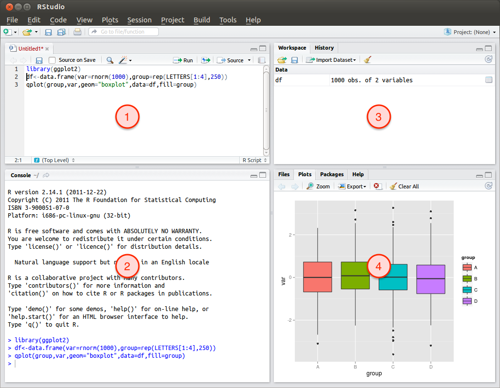

```{r setup, include=FALSE}
knitr::opts_chunk$set(
  # pour l'énoncé
  echo=FALSE, eval=FALSE
  # pour la correction
  # echo=TRUE, eval=TRUE
)
```

TODO add length, unique, rep, seq

# Introduction to statistics and R

## R and RStudio

R is a programming language oriented towards data analysis. It allows to read data from text files, perform computations on the data using a myriad of available functions, and produce plots or new data tables as the result of the analyses.

Download it from <http://cran.r-project.org/>. The installation is a matter of double clicking the installer and saying OK to everything.

R code is just text, so you can edit it with any text editor (Notepad etc.) but having a dedicated editor helps. On all platforms, RStudio <http://rstudio.org/> provides a complete development environment for R. This is what we will use.

We will always open R through RStudio by just double clicking on the icon.

The RStudio interface looks like this



Where

1. Source code editor: this is where we will write commands that can then be sent to be executed in the console. The file can then be saved as a "R Script".
2. Console: write or copy-paste code here and press enter to see the result.
3. Workspace: when we assign a value to a variable or read data from a file, the name and description of the variable/data will be displayed here.
4. Plots: space where plots appear and from which they can be saved; Files: file browser (to pick R scripts to be edited or data files to be imported); Help: where you can search R's documentation.


## Syntax and operators

```{r echo=TRUE}
2 + 4
# spaces don't matter
2+4
# line breaks are handled when R "knows" to expect something
2+
4
```
```{r echo=TRUE, eval=FALSE}
# but the following does not work
2
+4
```

Use spaces and linebreaks to make your code *human*-readable. To R it does not matter, to your collaborators (or you in two months) it does!

```{r echo=TRUE}
# arithmetic operators
4 - 5
3 * 4
3 / 5
3^2
4^-1
3 * (2 + 5)
# modulo
4 %% 2
4 %% 3
```

```{r echo=TRUE}
# logical operators
3 == 2
3 != 2
3 > 2
3 >= 2

4==4 & 5==6
4==4 | 5==6

!(4==4 | 5==6)
```

Practice

- compute powers of 35 until 3
- write a line which tests if 246 is odd or even (should answer TRUE if even)
- what is the result of (without executing it):

```{r echo=TRUE, eval=FALSE}
( 5 == 4 | 8 / 2 == 4 ) & 3 > 1.5 * 2

! 3 > 5 & 2 == 2
```

```{r}
  35^1
  35^2
  35^3

  ( 246 %% 2 ) == 0

  ( 5 == 4 | 8 / 2 == 4 ) & 3 > 1.5 * 2
  ! 3 > 5 & 2 == 2
```


## Data formats and indexing

Values can be assigned to variables. For example

```{r echo=TRUE}
# assigning a value
x = 3
# this form is preferred in R
x <- 3
# because
x = 3
y = 4
x = y
# this is slightly unclear: is the value of y put in x or the opposite?
# this, on the other hand, is explicit
x <- y
```

### Scalars

```{r echo=TRUE}
# numbers = numeric or integer
x <- 3
# or text = character string
x <- "a"
x <- "foo"
# or booleans = logical
x <- TRUE
x <- FALSE
```

Once defined, variables appear in the Workspace tab together with their types, dimensions, and some of the values they store.


```{r echo=TRUE}
# they can be overwritten
x <- 2
x
x <- 5
x
# or computed with
x * 2
```

Note on variable names:

- should be simple but explicit
- should not start with a number
- can use `_`, `.`, or case to separate words: `my_variable`, `my.variable`, `myVariable`. The `.` is not the best idea (because it has a special meaning in R) even though you will find it often used.

Practice:

- Define a variable that contains your name.
- Define another one that contains your age.

```{r}
my_name <- "Jean-Olivier"
my_age <- 25
# although I have been 25 for quite some time now.
```

### Vectors

```{r echo=TRUE}
x <- c(2, 5, 6)   # c() stands for "combine"
x
# vectors of several kinds
x <- c("foo", "bar")
x
x <- c(TRUE, FALSE, T, T, F)
x
# but a vector can contain only one data type
x <- c(1, "foo", TRUE)
x
# x now contains the string "1" and the string "TRUE". Those are not a number and a boolean anymore

# special case: vector of integers
1:10

# extracting data from a vector
x <- c(2, 45, 33, 56)

# specify the index, the position you want to extract
x[2]
# or several indexes
x[c(1,3)]

# TODO maybe skip that and just use `subset()` later on
# logical indexing: specify TRUE for the elements you want
x[c(TRUE, FALSE, TRUE, FALSE)]
# and since
x < 40
# returns a logical vectors, you can do things like
x[x < 40]
# and that's very cool (and immensely useful)

# a particular case
x <- factor(c("small", "medium", "large", "small"))
x[c(1,2)]       # the factor levels are remembered
class(x)
as.numeric(x)   # factors are coded internally as integers
```

Practice

- create a vector 
- extract data from a vector

### Matrices

Can we skip them?

```{r echo=TRUE}
x <- matrix(c(1,2,4,5,2,6), nrow=2)
x

# indexing matrices
x[1,3]
x[1,]           # all columns

# default multiplication is term by term
x * x
# matrix multiplication is done with %*%
y <- matrix(c(1,2,1,4,5,4), nrow=3)
x * y   # term by term multiplication does not work because the matrix do not have the same size
x %*% y # matrix multiplication is OK
x
y
```

### Tabular data (`data.frame`)

A spreadsheet-like table can be stored as a `data.frame` in R. The data.frame is you friend. You shall love the data.frame and cherish it with all your heart.

```{r echo=TRUE}
# each column is a vector
x <- c(1,2)
y <- c(4,6)
data.frame(x, y)

# can be constructed directly
data.frame(c(1,2), c(4,6))

# can use columns of different data types (as in a spreadsheet, yay!)
data.frame(c(1,2), c("foo","bar"))

# TODO change that to meteo data
# can use named columns
data.frame(species=c("C. helgo", "S. smaris", "S. plichardus"), abundance=c(100, 22, 2), volume=c(1200, 1000, 1100))

# the constraints are:
# - each column can only hold one type of data (remember, each column is a vector)
# - all columns must have the same number of lines
data.frame(species=c("C. helgo", "S. smaris"), abundance=c(100, 22, 2), volume=c(1200, 1000, 1100))
# doesn't work
# BUT, be careful, this would work
data.frame(species=c("C. helgo", "S. smaris"), abundance=c(100, 22, 2, 5), volume=c(1200, 1000, 1100, 500))
# because the vectors get repeated an appropriate number of times. This can lead to mistakes but allows to do
data.frame(species=c("C. helgo", "S. smaris", "S. plichardus"), abundance=1)

x <- data.frame(species=c("C. helgo", "S. smaris", "S. plichardus"), abundance=c(100, 22, 2), volume=c(1200, 1000, 1100))

# indexing data.frames
x[2,3]          # as a matrix
x[1,]
x[,2]
x[,c(1,2)]
x[,"species"]   # by name
x$species       # useful shorthand
# creating a column
x$concentration <- 1 # automatically expands the variable
x
# or put content for each line (like expanding a formula in excel does)
x$concentration <- x$abundance / x$volume
x
```

Practice:

- create a new data.frame containing the season (as factor), a numeric value for the estimate average temperature in Paris during is season, and a boolean telling whether you like this season or not
- extract the temperature in Paris from the following data frame

```{r echo=TRUE, eval=TRUE}
d <- data.frame(
  city=c("Nice", "Paris", "Brest"),
  temperature=c(25, 18, 14)
)
d
```

```{r}
  meteo <- data.frame(
    season=factor(c("Spring", "Summer", "Autumn", "Winter")),
    temp=c(18, 25, 17, 10),
    like=c(TRUE, FALSE, TRUE, FALSE)
  )
  meteo
```


### Lists

```{r echo=TRUE}
x <- list(c(1,2,3), c(45.3, 56.4), c("foo","bar"), c(TRUE,FALSE,FALSE))
x
# named lists
x <- list(a=c(1,2,3), second_element=c(45.3, 56.4), whatever=c("foo","bar"), last=c(TRUE,FALSE,FALSE))
x
# indexing lists
x[[1]]
x[["a"]]
x$a
x[c(1,3)]       # !! simple brackets to extract a sub-list
y <- x[[1]]
class(y)        # extracts the content of the first element of x
z <- x[1]
class(z)        # extracts a list with one element
# NB: data.frames are lists
```

Practice

- extract data from an unamed list
- extract data from a named list


## Missing values

```{r echo=TRUE}
# missing values = Non Available
x <- c(3, 4.1, NA, 5)
x
is.na(x)
na.omit(x)

# NA are "contagious"
x + 1

d <- data.frame(x=c(1, 2), y=c(3.5, NA))
d
na.omit(d)
# removes the whole line!
```

## Functions and help

```{r}
# we want to compute the average (mean) of several numbers. How do we do that?
# 1. Google for it and find tutorials (in particular using the dedicated http://rseek.org/)
# 2. search all installed R functions for something that works
??mean

# lookup the syntax of one of them
?mean
# always the same categories:
#   - Quick description
#   - Calling syntax
#   - Description of the arguments
#   - Details about the implementation/usage
#   - Value returned by the function
#   - Authors
#   - Other functions similar to the current one
#   - Examples of usage
```

Practice

- compute the mean of temperature values in the data.frame you created earlier

mean(meteo$temp)


---

## Setup a data analysis project

A good organisation for an R project is:

- a main directory which holds the data and the scripts (e.g. my_project)
  NB: scripts are text files with a sequence of R commands
- the scripts are all in the main directory (e.g. `my_project/analysis.R`, `myProject/data_reading.R`)
- the data can be in sub-directories (e.g. `my_project/CTD/ctd_station1.txt`)
- the scripts should work locally, from the project directory (e.g. reference `CTD/ctd_station1.txt` but not `/Users/yourname/Documents/my_project/CTD/ctd_station1.txt`). This way, the project can be moved anywhere on your machine and is even portable from computer to computer

A script file contains both commands and comments (lines starting with #)
Comments are essential and should help you understand what you did a week, a month, or a year from now.

Practice:

- Start a new project directory, copy the data in a subdirectory called "data", start a new script (File > New script), save it in the project directory with a name ending in ".R" (intro_to_R.R for example), read the three data files
RStudio has a graphical tool to read data : `Workspace > Import Dataset > From Text File`
Once the parameters are chosen, the appropriate function is written to the console
Copy it in your script to avoid having to use the interface in the future


## Import data

```{r echo=TRUE}
d <- read.csv("meteo/mini.csv")
d
d <- read.delim("meteo/mini.tsv")
d
d <- read.table("meteo/mini.txt", header=TRUE)
d
```

## Descriptive statistics

```{r echo=TRUE}
# observe the data structure
str(d)
head(d)
tail(d)

mean(d$temperature)
median(d$temperature)
quantile(d$temperature, probs=c(0.25, 0.5, 0.75))
IQR(d$temperature)
summary(d$temperature)
summary(d)

var(d$temperature)
sd(d$temperature)
mad(d$temperature)
```

Practice


## Manipulate and subset data

```{r}
subset(d, subset=annee == 2015)
subset(d, subset=annee > 2015)
subset(d, subset=annee >= 2015)
subset(d, subset=(annee >= 2015 & temperature > 14))
subset(d, subset=(annee == 2014 | annee == 2016))

subset(d, subset=annee == 2015, select=c(pression, temperature))
subset(d, subset=annee == 2015, select=c(-pression, -temperature))
subset(d, subset=annee == 2015, select=c(station:temperature))

# add column
d$temperatureF <- d$temperature * 9/5 + 32
```

Practice


## Plots

```{r echo=TRUE}
plot(x=d$temperature, y=d$precipitations)
plot(precipitations ~ temperature, data=d)

nice_colors <- hcl(seq(10, 340, length.out=4), c=80, l=65)
plot(precipitations ~ temperature, data=d, col=rep(nice_colors, times=4), pch=16)
legend(8, 1400, legend=2013:2016, col=nice_colors, pch=16)

boxplot(precipitations ~ annee, data=d)
stripchart(precipitations ~ annee, data=d, vertical=TRUE)
boxplot(precipitations ~ station, data=d)

hist(d$temperature)
hist(d$temperature, breaks=10)

d <- read.csv("meteo/mois.csv")

```

Practice

## Simulate data and inspect distributions

```{r echo=TRUE}
runif(10)

x <- rnorm(30)
hist(x)
x <- rnorm(100)
hist(x)
x <- rnorm(10000)
hist(x)

x <- rpois(50, 10)
hist(x)
x <- rpois(10000, 10)
hist(x)


x <- matrix(runif(100), ncol=10)
dim(x)
hist(rowMeans(x), bins=10)

x <- matrix(runif(300), ncol=10)
dim(x)
hist(rowMeans(x), bins=10)

x <- matrix(runif(1000), ncol=10)
dim(x)
hist(rowMeans(x), bins=10)

x <- matrix(runif(10000), ncol=10)
dim(x)
hist(rowMeans(x), bins=10)

x <- rnorm(100000)
sum(x < 0.7) / 100000
pnorm(0.7)

qnorm(0.5)

qnorm(0.975)

quantile(rnorm(100), probs=c(0.975))
quantile(rnorm(100), probs=c(0.975))
quantile(rnorm(100000), probs=c(0.975))
```

